# hospitals_ETL
## Overview of Project
* Create a data source of hospitals around the USA and identify if they are a children's hospital or not

### Purpose
   
* We are utilizing everything we have learned about Python, Pandas, SQL, and ETL on Jupyter Notebook and PgAdmin to create a database for the given data.

## Analysis

* Extract Data from sources
    * https://www.kaggle.com/datasets/digitalbro/usa-childrens-hospitals
    * https://data.world/dhs/hospitals
    * We used two data sources for our project. The first was hospital data found on Data.world, we tried to use the excel file, but it was too large for GitHub, so we choose to use the CSV instead. The second data we found on Kaggle, it was a file of a collection of children hospitals in the USA.
* Clean and Format the data
    * During the data formatting we utalized jupyter notebook. First we inported the data use put them into separate data frames. Then we made a common column to combine on and did a left merge to merge the dataframe together. Once merged we dropped the repeated columns, and renamed the coluns remaining. After combinning the data and cleaning it up we exported the data into a new csv file to be used to make a database in PGAdmin.
### Jupyter Notebook Pictures
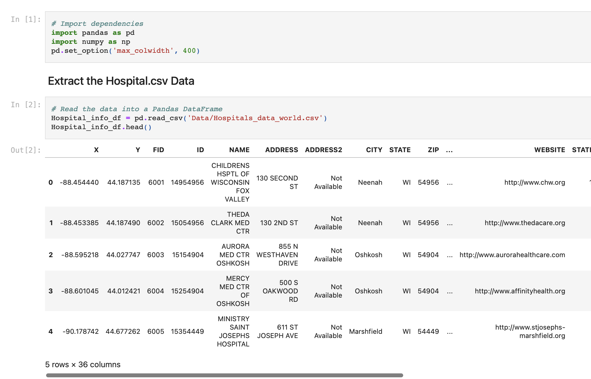
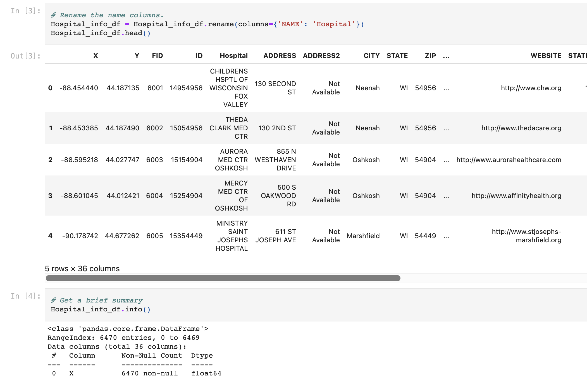
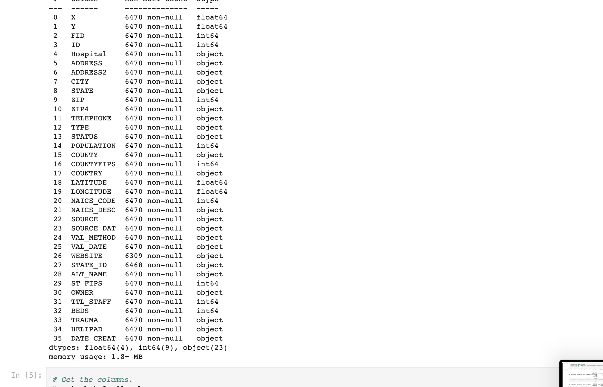
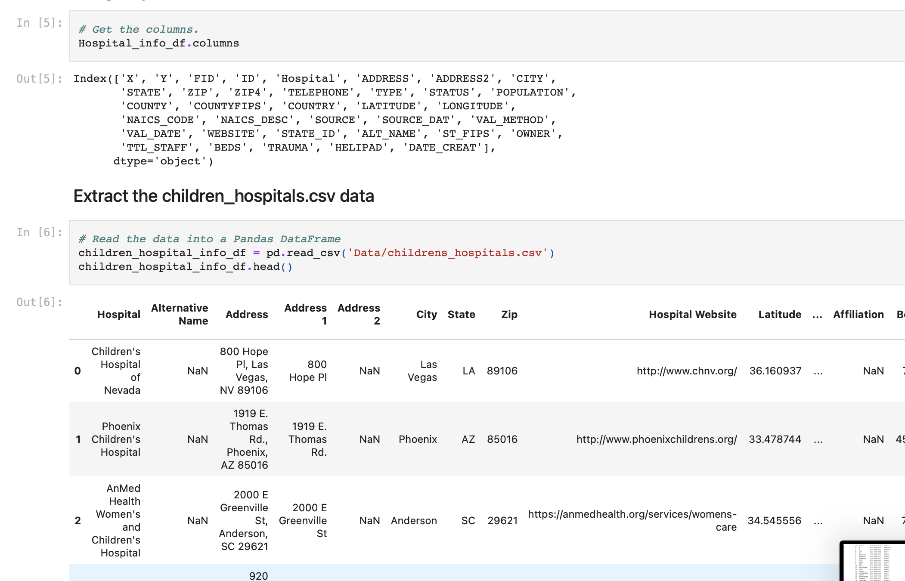
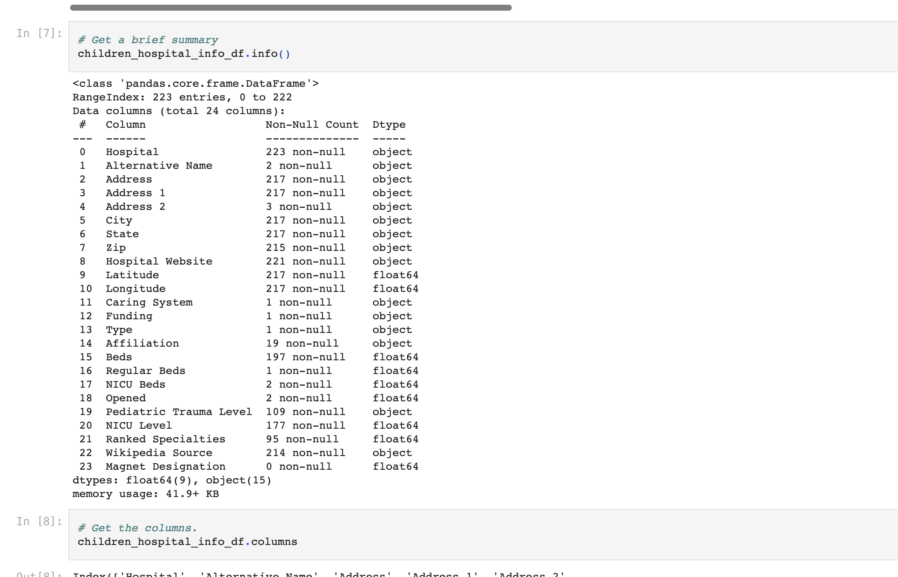
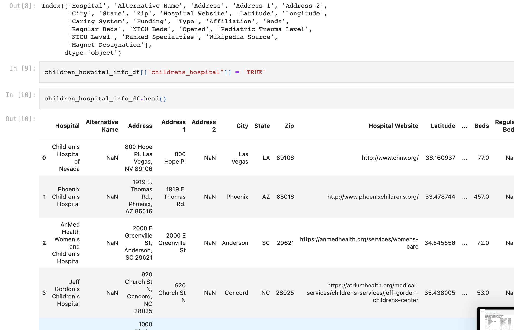
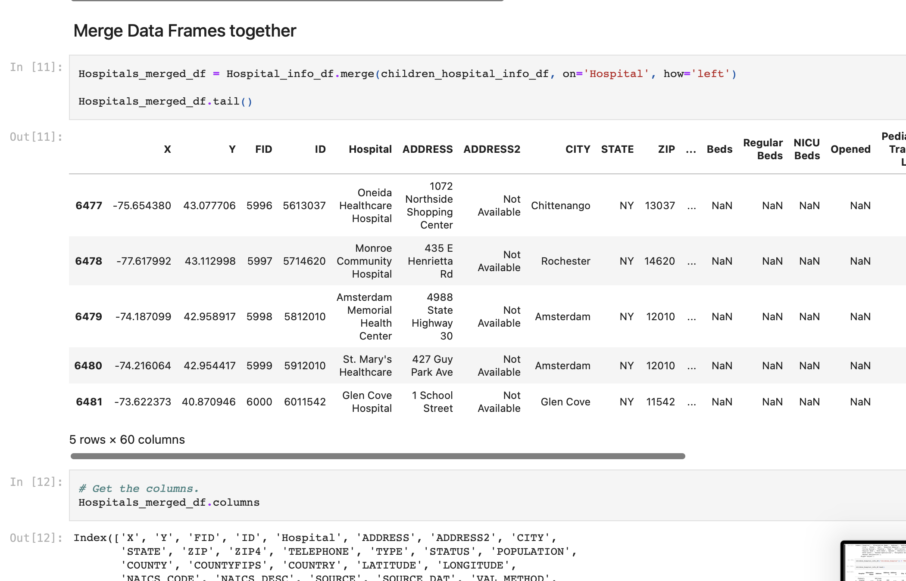
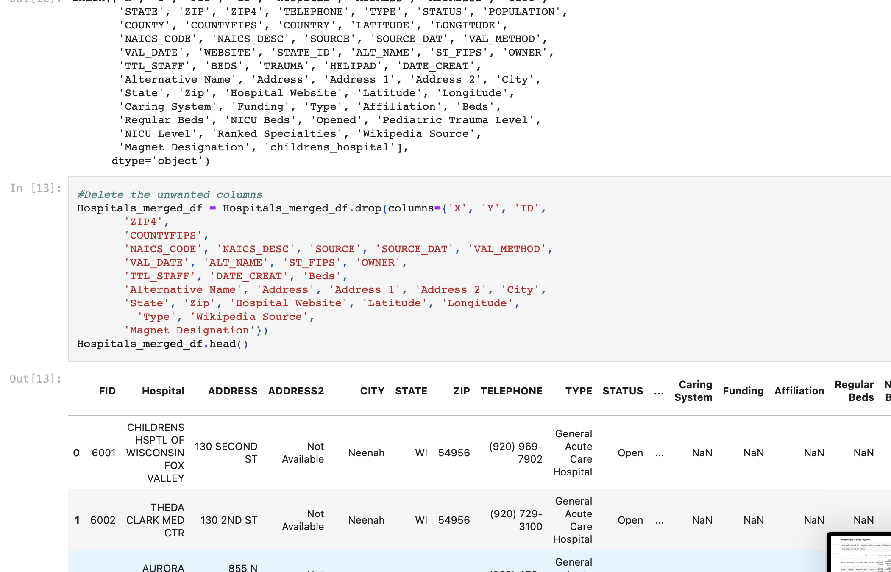
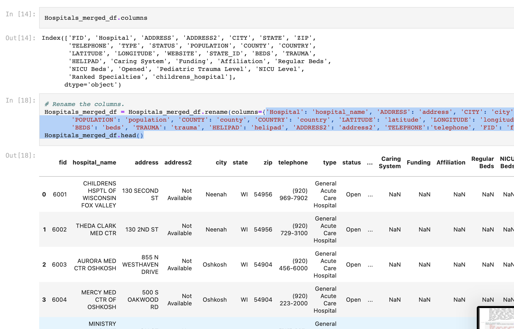
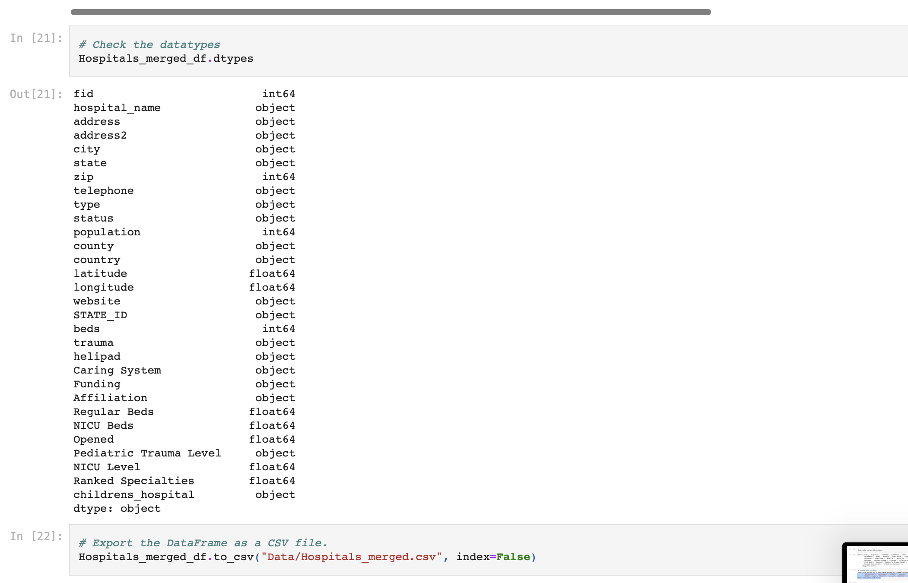
* Create a database with the data
    * 
### PGAdmin4 Picture
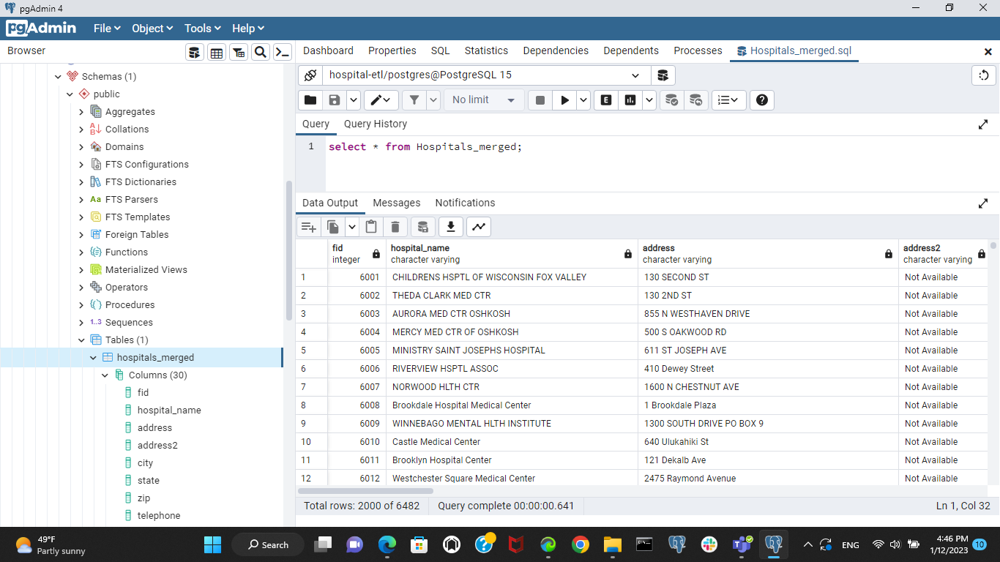
